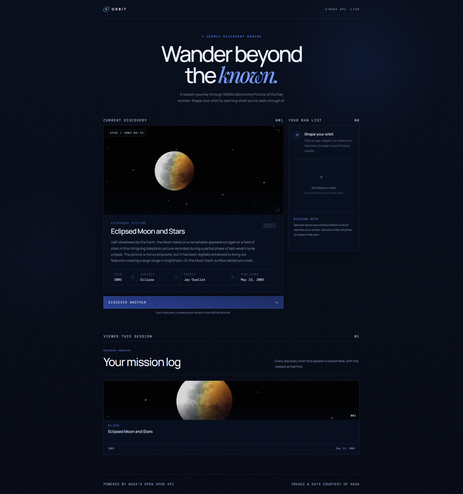

# Web Development Project 4 - *Orbit*

Submitted by: **Yaritza**

This web app: **A NASA-themed discovery experience that displays random
Astronomy Picture of the Day images and lets users shape future results
by banning years, subjects, and image credits.**

Time spent: **4** hours spent in total

## Required Features

The following **required** functionality is completed:

- [x] **Application features a button that creates a new API fetch request on click and displays at least three attributes and an image obtained from the returned JSON data**
  - Every result consistently displays its year, subject, credit, and
    publication date.
- [x] **Only one item/data from API call response is viewable at a time and at least one image is displayed per API call**
  - A single NASA APOD result is displayed at a time.
  - Each displayed attribute is derived from the same APOD record as the
    displayed image.
  - Video results are skipped so every displayed result includes an image.
- [x] **API call response results should appear random to the user**
  - Clicking **Discover Another** requests a random batch from NASA's APOD
    archive and selects a result that has not recently been displayed.
- [x] **Clicking on a displayed value for one attribute adds it to a displayed ban list**
  - The year, subject, and credit attributes are clickable.
  - Clicking an attribute immediately adds it to the ban list.
  - Clicking an attribute in the ban list immediately removes it.
- [x] **Attributes on the ban list prevent further images/API results with that attribute from being displayed**
  - Random results are checked against every banned year, subject, and
    credit before being displayed.
  - [x] _The walkthrough recording will show that clicking an attribute in
    the ban list immediately removes it._

The following **optional** features are implemented:

- [x] Multiple types of attributes are clickable and can be added to the ban list
- [x] Users can see a stored history of their previously displayed results from this session
  - [x] A dedicated section of the application displays all the previous
    images/attributes seen before.
  - [x] Each time the API call button is clicked, the history updates with the
    newest API result.

The following **additional** features are implemented:

- [x] APOD results are classified into subjects such as Galaxy, Nebula,
  Planet, Moon, Comet, and Spacecraft.
- [x] Loading, API rate-limit, malformed response, and temporary NASA
  connection errors are handled with user-friendly states.
- [x] The layout is responsive for desktop and mobile screens.
- [x] A personal NASA API key can be stored safely in a local `.env` file.

## Video Walkthrough

Here's a walkthrough of implemented user stories:

<!-- Replace the link above with the URL of your completed walkthrough GIF. -->
GIF created with **ScreenToGif**

## Notes

Challenges encountered while building the app included handling occasional
non-JSON responses from the NASA API, ensuring every displayed APOD result
was an image rather than a video, and filtering randomly returned results
against multiple ban-list categories.

## License

    Copyright [2026] [Yaritza Yanez]

    Licensed under the Apache License, Version 2.0 (the "License");
    you may not use this file except in compliance with the License.
    You may obtain a copy of the License at

        http://www.apache.org/licenses/LICENSE-2.0

    Unless required by applicable law or agreed to in writing, software
    distributed under the License is distributed on an "AS IS" BASIS,
    WITHOUT WARRANTIES OR CONDITIONS OF ANY KIND, either express or implied.
    See the License for the specific language governing permissions and
    limitations under the License.
